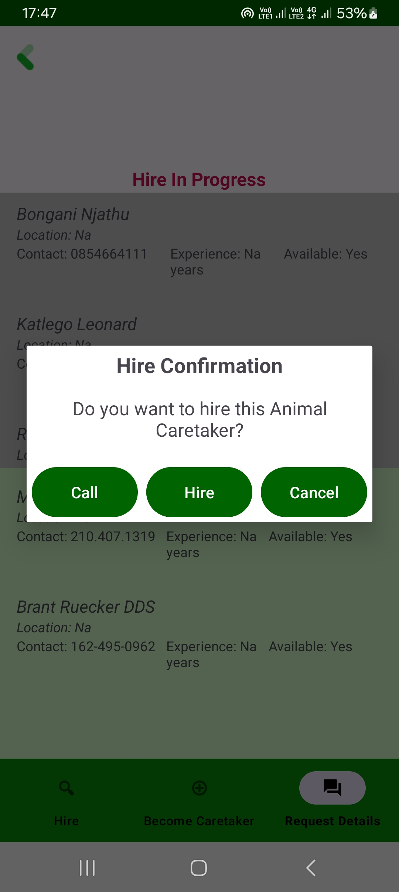
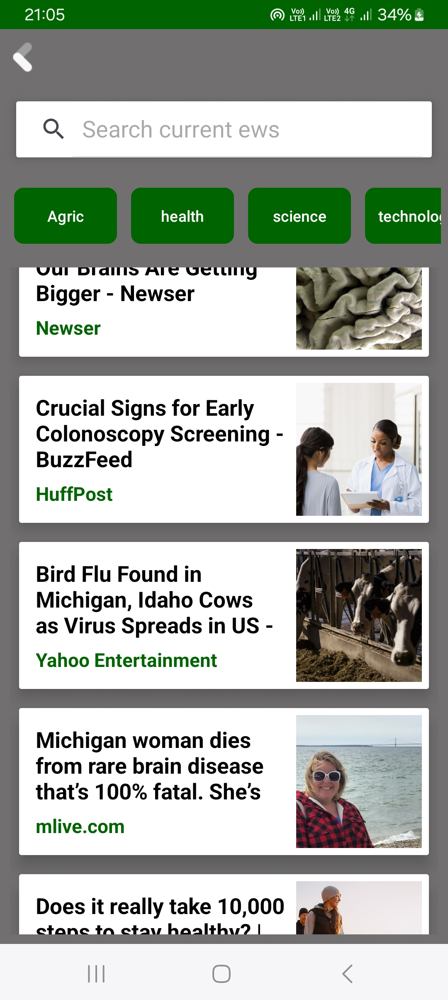

 # FarmGuardian

## UI mockups

### Recent Highlights

 

(or visit the "Screenshot" folder)

## Configuration Setup:

Sensitive File Requirements:

This project requires certain .json files for configuration purposes. However, to maintain security, these files are not included in the repository. You will need to obtain these files separately and place them in the following locations:

app/google-services.json: [file can be found from google firebase. After registering this app in your Firebase poject,firebase will generate a google-services.json file specifically configured for this app.],

"app/src/main/assets/api.properties" file if there are still some challenges[create an API key (https://newsapi.org/) and place it here (app/src/main/assets/api.properties)for the variable API_KEY] .

ALternatively use android studio to bypass login activities in which case you wont have your app data.

Build and Run

## Description and features

(FarmGuardian Website and some fearures for this mobile app are still under maintanance.)

FarmGuardian is a mobile application with services:

- **_Equipment Sharing_**:

Function: Facilitate sharing of agricultural equipment among farmers.

Example: Farmers can rent or share equipment, reducing costs for individual farmers.

- **_Community Building_**:

Function: community platform for farmers to share experiences and insights.

Example: Farmers can discuss challenges, share tips, and support each other.

- **_Market Access_**:

Function: Facilitate direct access to markets for farmers to sell their produce.

Example: Marketplace feature connecting farmers with buyers, eliminating middlemen.

- **_Get help_**:

Function: AI in FG to help clients with sick livestock live and offer other assistant withing FG app

Example: chat page to communicate with artificial pet

Function: Hire new animal caretakers

Example: Hire someone professional to come and take care of your livestock anywhere,anytime

Function: find lost livestock

Example: let other farmers know of your lost livestock and get notified when its seen somewhere

- **_Alerts_**:

Function: Get up to date with the world's or local current agriculture news and nature hazards.

Example: See trending agriculture news from ML /AI models, tips, cautious weather updates.

## Contribution

I welcome contributions from the community to enhance FarmGuardian. To contribute, follow these steps:

Fork the repository.

Create a new branch for your feature: git checkout -b feature-name.

Commit your changes: git commit -m 'Add some feature'.

Push to the branch: git push origin feature-name.

Submit a pull request.

For major changes, please open an issue first to discuss potential changes.

## License

[Creative Commons Attribution-NonCommercial-NoDerivatives 4.0 International License](LICENSE.md).

## Attribution

- Current Project Author: BONGANI NJATHU
- Date: December 24, 2023

Feel free to use and share this project in accordance with the license terms.
