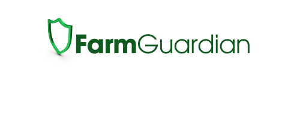
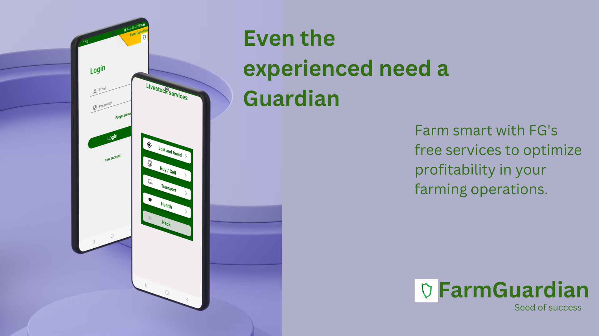
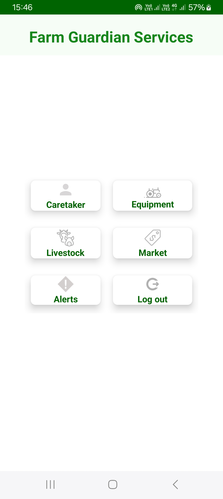
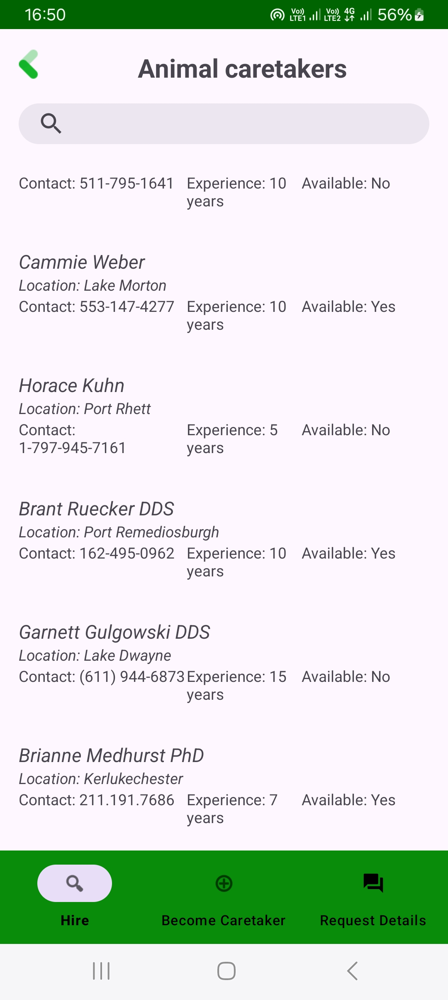
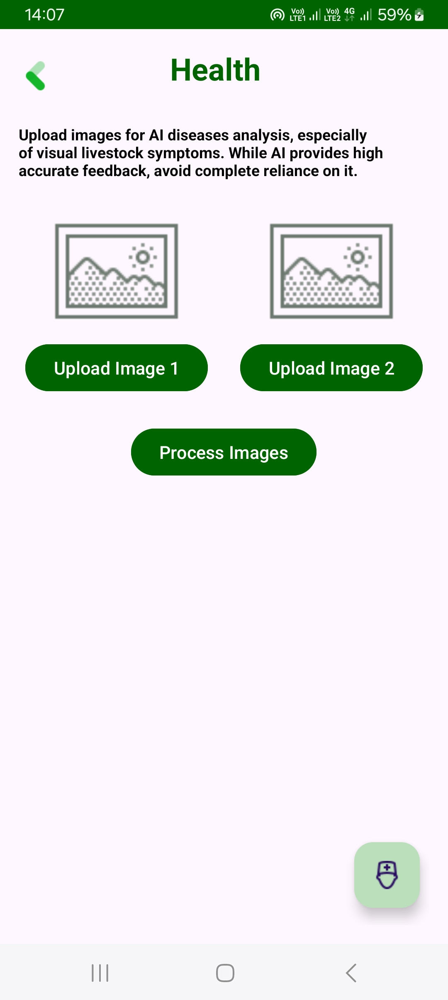
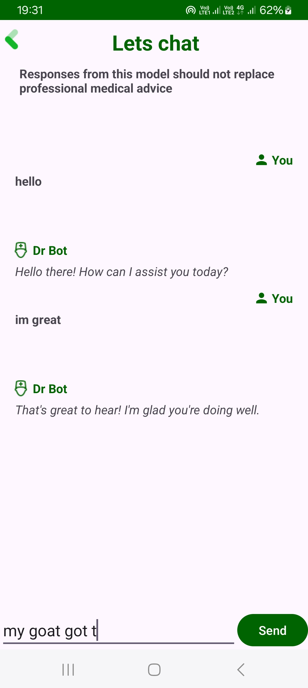
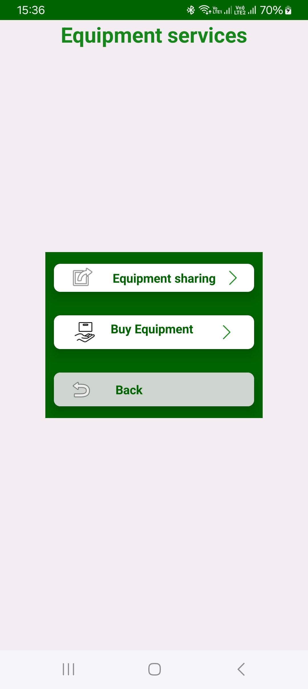
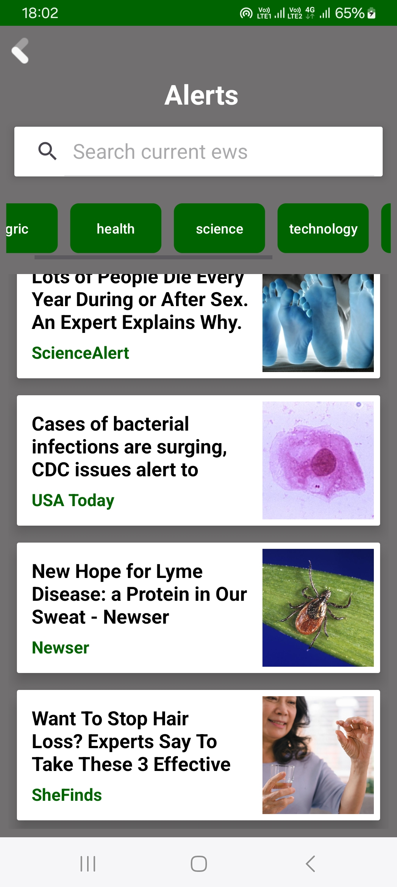

 
 

### Recent Highlights

 

{more on the "/Screenshot" folder}

## Configuration Setup:

This project requires certain .json files for configuration purposes. However, to maintain security, these files are not included in the repository. You will need to obtain these files separately and place them in the following locations:

app/google-services.json: [file can be found from google firebase. After registering this app in your Firebase poject,firebase will generate a google-services.json file specifically configured for this app.],

"app/src/main/assets/api.properties" file if there are still some challenges[create an API key (https://newsapi.org/) and (https://ai.google.dev/) and place them seperately here (app/src/main/assets/api.properties)for the variable API_KEY] .

Build and Run

## Description and features

(FarmGuardian Website and some fearures for this mobile app are still under maintanance.)

FarmGuardian  android is a mobile application with services:

- **_Equipment Purchaces & Sharing(Equipment service)_**:

Facilitate access of agricultural equipment among farmers, Farmers can buy, rent or share equipment, reducing costs for individual farmers.

- **_Market Access(Market service)_**:

Facilitate direct access to markets for farmers to sell their produce, Marketplace feature connecting farmers with buyers, eliminating middlemen.

- **_Get help(multiple services)_**:

 AI integration in FG to help clients with sick livestock live and offer other assistant withing FG app, chat page to communicate with artificial pet

 Hire new animal caretakers, Hire someone professional to come and take care of your livestock anywhere,anytime

 Find lost livestock, let other farmers know of your lost livestock and get notified when its seen somewhere

- **_Alerts(Alert service)_**:

See trending agriculture news from ML /AI models and APIs, tips, cautious weather updates.

- **_and more_**:

## Contribution

I welcome contributions from the community to enhance FarmGuardian. 

For major changes, please open an issue first to discuss potential changes.

## License

[Creative Commons Attribution-NonCommercial-NoDerivatives 4.0 International License](LICENSE.md).

##### Founder and Author: Bongani Njathu

##### December 24, 2023

