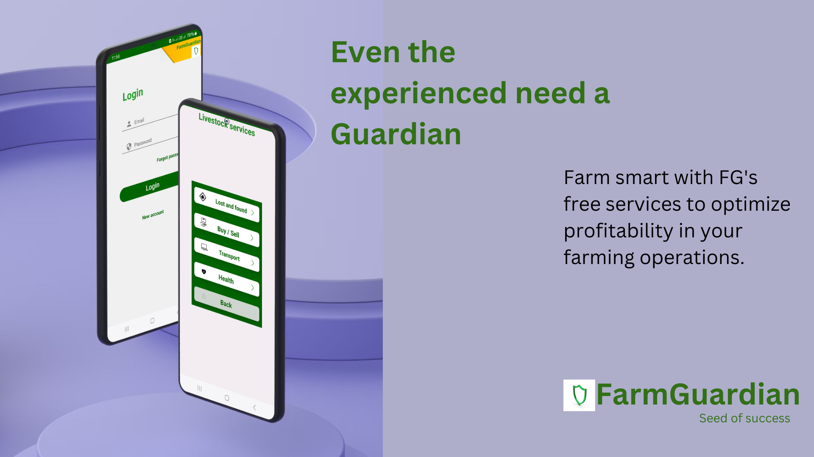
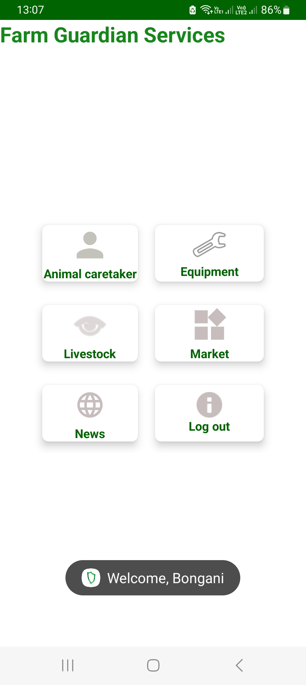
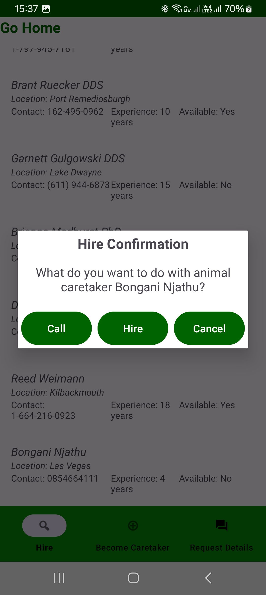
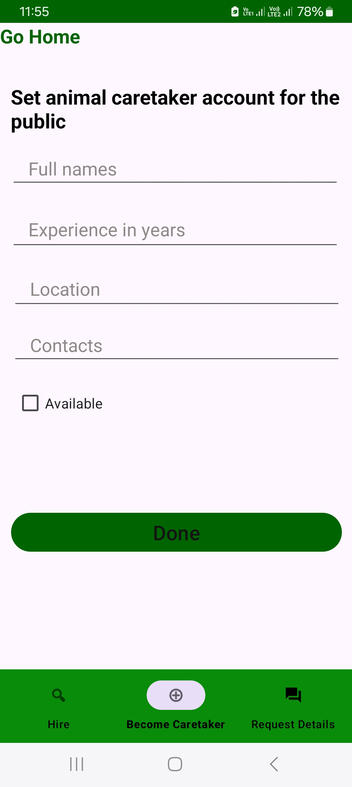

 
# FarmGuardian

## Table of Contents

UI mockups

Installation

Description

Features

Contributing

License

## UI mockups

### Current Higlights

 

(or view "Highlights.HTML" file)

## Installation

details soon to be posted 

## Description

FarmGuardian is a mobile application aiming to implement:

* ***Equipment Sharing***:

Function: Facilitate sharing of agricultural equipment among farmers.

Example: Farmers can rent or share equipment, reducing costs for individual farmers.

* ***Community Building***:

Function:  community platform for farmers to share experiences and insights.

Example: Farmers can discuss challenges, share tips, and support each other.

* ***Market Access***:

Function: Facilitate direct access to markets for farmers to sell their produce.

Example: Marketplace feature connecting farmers with buyers, eliminating middlemen.

* ***Get help***:

Function: AI to help sick livestock and offer other assistant

Example: chat page to communicate with artificial pet

Function:  Hire  new animal caretakers 

Example:  Hire someone professional to come and take care of your livestock anywhere,anytime

Function: find lost livestock

Example:  let other farmers know of your lost livestock and get notified when its seen somewhere

* ***News***:

Function: Get up to date with the world's or local current agriculture news and nature hazards.

Example: See trending news, tips, cautious weather updates, market & currency .

## Features

User Authentication: Secure login and registration for farmers and caretakers.

Profile Management: Users can update their profiles with relevant information.

Search and Apply: Farmers can search for caretakers based on criteria, and caretakers can apply for available positions.

Real-time Notifications: Users receive notifications for new applications and job updates.

## Contributing
I welcome contributions from the community to enhance FarmGuardian. To contribute, follow these steps:

Fork the repository.

Create a new branch for your feature: git checkout -b feature-name.

Commit your changes: git commit -m 'Add some feature'.

Push to the branch: git push origin feature-name.

Submit a pull request.

For major changes, please open an issue first to discuss potential changes.

## License

This project is licensed under the [Creative Commons Attribution-NonCommercial-NoDerivatives 4.0 International License](LICENSE.md).

## Attribution

- Current Project Author: BONGANI NJATHU
- Date: December 24, 2023

Feel free to use and share this project in accordance with the license terms.

